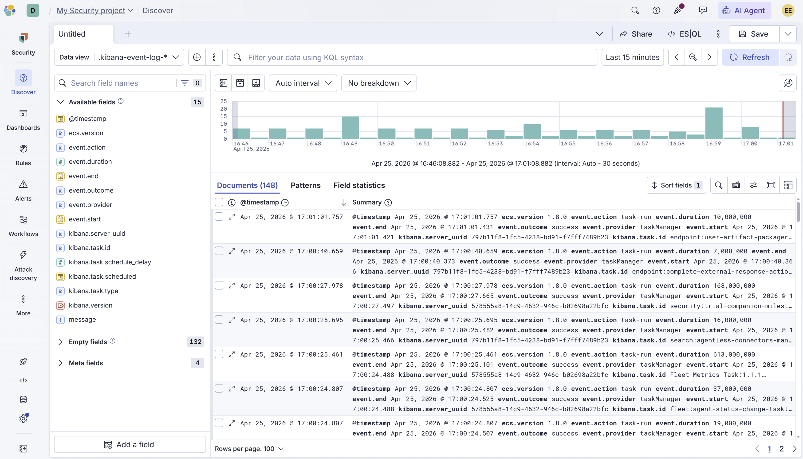
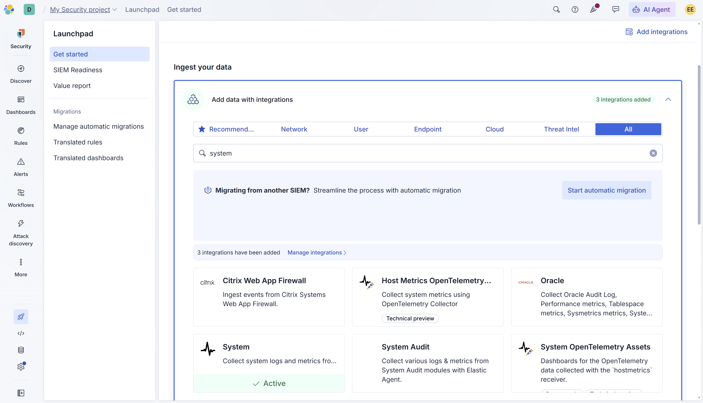
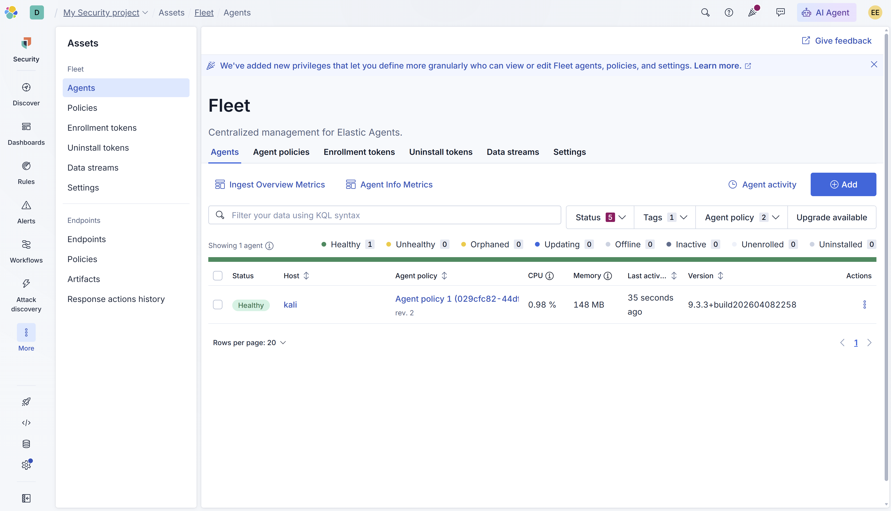

# SOC Lab 11 — Elastic SIEM Setup

## Table of Contents
1. [Executive Summary](#executive-summary)
2. [Incident Ticket (ServiceNow Simulation)](#incident-ticket-servicenow-simulation)
3. [Lab Objectives](#lab-objectives)
4. [Environment Overview](#environment-overview)
5. [Detection Workflow](#detection-workflow)
6. [SIEM Configuration](#siem-configuration)
7. [Detection Engineering Insights](#detection-engineering-insights)
8. [Evidence](#evidence)
9. [Conclusions](#conclusions)
10. [Next Steps](#next-steps)

---

## Executive Summary

This lab documents the deployment and configuration of Elastic Security as a cloud-based SIEM platform for SOC operations.

Elastic Security is an enterprise-grade SIEM and XDR platform used by security teams to ingest, analyze, and respond to security events at scale. Understanding how to deploy and configure a SIEM is a foundational skill for SOC analysts, as it forms the backbone of modern threat detection and incident response workflows.

In this lab, Elastic Security was deployed via Elastic Cloud Serverless. The Elastic Agent was installed on a Kali Linux virtual machine and enrolled into Fleet for centralized management. System logs were successfully ingested into Elastic and confirmed visible in the Kibana Discover interface.

This lab establishes the SIEM foundation for subsequent detection engineering, alert configuration, and threat hunting labs.

---

## Incident Ticket (ServiceNow Simulation)

**Incident ID:** INC-0011
**Date/Time Detected:** 2026-04-25 16:46
**Detected By:** SOC Analyst (Lab Simulation)
**Severity:** Informational
**Category:** SIEM Operations
**Subcategory:** Agent Deployment / Log Ingestion

---

### Short Description
Elastic Security SIEM deployed and configured. Elastic Agent successfully enrolled on Kali Linux host with system log ingestion confirmed.

---

### Detailed Description
Elastic Security was provisioned via Elastic Cloud Serverless using the Security use case profile. The System integration was configured to collect system logs and metrics from the Kali Linux virtual machine.

The Elastic Agent (v9.3.3) was downloaded, installed, and enrolled into Elastic Fleet. The agent reported a Healthy status and began transmitting log data to the Elastic Stack. Ingestion was confirmed in the Kibana Discover interface with 148 documents observed within the first 15 minutes of operation.

---

### Indicators of Compromise (IOCs)
- N/A — Informational lab focused on SIEM deployment and configuration

---

### Analysis
SIEM deployment was completed successfully. The Elastic Agent established a connection to Elastic Cloud and began ingesting system-level telemetry including event actions, outcomes, timestamps, and task metadata.

Log ingestion confirmed the pipeline is operational and ready for detection rule configuration and threat hunting activities in subsequent labs.

---

### Impact Assessment
- No security threat identified
- SIEM platform operational and ingesting data
- Foundation established for detection engineering and alerting

---

### Response Actions Taken
- Provisioned Elastic Security via Elastic Cloud Serverless
- Configured System integration for log and metric collection
- Installed Elastic Agent on Kali Linux VM
- Enrolled agent into Elastic Fleet
- Confirmed agent health status as Healthy
- Verified log ingestion in Kibana Discover

---

### Recommended Actions
- Configure detection rules in subsequent lab
- Set up alerting thresholds for suspicious activity
- Expand log sources as lab environment grows
- Monitor agent health regularly via Fleet dashboard

---

### Status
Closed (Configuration Successful)

---

## Lab Objectives

- Deploy Elastic Security via Elastic Cloud Serverless
- Configure the System integration for log ingestion
- Install and enroll Elastic Agent on a Kali Linux host
- Verify agent health and connectivity via Elastic Fleet
- Confirm log ingestion in Kibana Discover
- Establish SIEM foundation for detection engineering labs

---

## Environment Overview

**Operating System:** Kali Linux (Virtual Machine)

**Tools Used**
- Elastic Security (Cloud Serverless)
- Elastic Agent v9.3.3
- Kibana Discover
- Elastic Fleet

**Network Setup**
- Kali Linux VM connected to Elastic Cloud via internet
- GCP Iowa (us-central-1) deployment region

---

## Detection Workflow

### 1. Provision Elastic Security

Elastic Security was provisioned via Elastic Cloud Serverless using the Security use case and SIEM and Security Analytics profile. The deployment was configured on GCP Iowa infrastructure.

---

### 2. Configure System Integration

The System integration was added to collect system logs and metrics from the Kali Linux host. The integration was configured with default settings and assigned to Agent Policy 1.

---

### 3. Install Elastic Agent

The Elastic Agent was installed on the Kali Linux VM using the Linux x86_64 installation package. The agent was installed with root privileges to enable full system log collection including auth logs, syslog, and disk I/O metrics.

**Installation command structure:**

```bash
curl -L -O https://artifacts.elastic.co/downloads/beats/elastic-agent/elastic-agent-<version>-linux-x86_64.tar.gz
tar xzvf elastic-agent-<version>-linux-x86_64.tar.gz
cd elastic-agent-<version>-linux-x86_64
sudo ./elastic-agent install --url=<fleet-url> --enrollment-token=<token>
```

---

### 4. Verify Agent Enrollment

Agent enrollment was confirmed in Elastic Fleet. The Kali Linux host appeared as a Healthy agent with active CPU and memory metrics reporting.

---

### 5. Confirm Log Ingestion

Log ingestion was verified in Kibana Discover. 148 documents were observed within the first 15 minutes of agent operation, confirming the data pipeline was functioning correctly.

---

## SIEM Configuration

### Elastic Cloud Deployment
- **Platform:** Elastic Cloud Serverless
- **Use Case:** Elastic for Security
- **Profile:** SIEM and Security Analytics
- **Region:** GCP Iowa (us-central-1)

### Integration
- **Integration:** System v2.16.2
- **Policy:** Agent Policy 1
- **Data Collected:** System logs, auth logs, syslog, disk I/O metrics

### Agent
- **Version:** 9.3.3
- **Host:** kali
- **Status:** Healthy
- **CPU Usage:** 0.98%
- **Memory Usage:** 148 MB

---

## Detection Engineering Insights

- A SIEM is only as effective as the data it ingests — agent health and log coverage are critical to monitor
- Elastic Fleet provides centralized visibility into all enrolled agents, enabling rapid identification of connectivity issues
- System logs provide foundational telemetry including authentication events, process activity, and system resource usage
- The Kibana Discover interface allows analysts to perform ad-hoc log searches and validate data ingestion before building detection rules
- Establishing a healthy data pipeline is the first step in any detection engineering workflow

---

## Evidence

All screenshots are stored in the repository and demonstrate Elastic SIEM deployment, integration configuration, and log ingestion confirmation.





---

## Conclusions

This lab successfully established a cloud-based Elastic SIEM environment with live log ingestion from a Kali Linux host. The Elastic Agent was installed, enrolled, and confirmed healthy, with system telemetry flowing into Kibana Discover within minutes of deployment.

This lab marks the transition from packet-level analysis to log-based detection, representing a significant step forward in the SOC analyst skill progression.

---

## Next Steps

- Lab 12: Elastic Detection Rules
- Configure and enable detection rules in Elastic Security
- Generate suspicious activity and trigger alerts
- Build analyst workflow from log ingestion to alert triage
